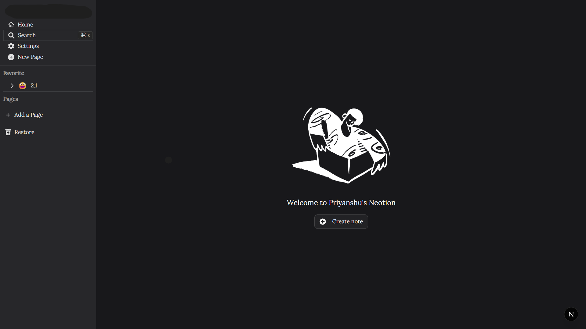
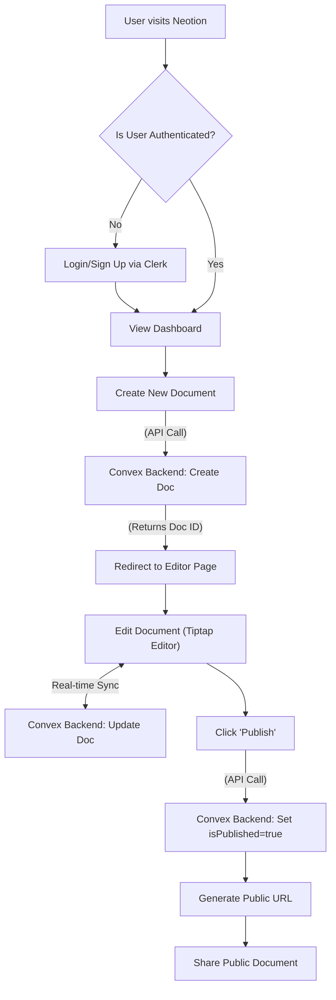

# Neotion

<p align="center">
  
</p>

<p align="center">
  A fast, secure, and extensible Notion-like clone built with modern web technologies.
</p>

<p align="center">
  <a href="#">
    
  </a>
  <a href="#">
    
  </a>
  <a href="#">
    
  </a>
  <a href="#">
    
  </a>
  <a href="#">
    
  </a>
</p>

---

## 📑 Table of Contents

- [🚀 Overview](#-overview)
- [✨ Core Features (The 80/20)](#-core-features-the-8020)
- [🧩 All Features](#-all-features)
- [🖼️ Screenshots](#️-screenshots)
- [🛠️ Tech Stack](#️-tech-stack)
- [📁 Project Structure](#-project-structure)
- [🔧 Installation](#-installation)
- [💻 Usage](#-usage)
- [⚙️ Environment Variables](#️-environment-variables)
- [🧪 Development & Code Quality](#-development--code-quality)
- [📜 License](#-license)

---

## 🚀 Overview

Neotion is a modern, open-source alternative to Notion, designed for users who need a fast, secure, and highly extensible workspace. It provides real-time collaborative editing, markdown support, and a clean, intuitive user interface, all powered by a robust tech stack including Next.js, Convex, and Clerk.

---

## ✨ Core Features (The 80/20)

This section highlights the key workflows that deliver the most value to our users. Understanding these features will get you up and running with Neotion's core functionality quickly.

### 1. Real-time Document Collaboration

At its heart, Neotion is a collaborative tool. Create or open a document, and you can edit it in real-time with your team. Changes are synced instantly across all users, ensuring everyone is on the same page.

<p align="center">
  
  <em>Create and organize your documents seamlessly.</em>
</p>

### 2. Document Publishing

Share your work with the world with a single click. Any document can be published to a public URL, making it easy to share notes, articles, or documentation.

<p align="center">
  
  <em>A clean, readable view for your published documents.</em>
</p>

### Core Workflow: From Creation to Publication

The most critical workflow in Neotion is creating, editing, and publishing a document. The diagram below visualizes this entire process, from user authentication to the final published page.



---

## 🧩 All Features

- **Real-time collaborative editing**
- **Markdown support** via Tiptap
- **Slash command palette** for quick actions
- **Secure authentication** with Clerk
- **Dynamic routing and nested documents** with Convex
- **Full-text search** across your workspace
- **Emoji support** for documents and icons
- **Calendar integration**
- **Cover images** for document personalization
- **File uploads** powered by EdgeStore
- **Light & Dark mode** themes

---

## 🖼️ Screenshots

<p align="center">
  <b>Empty State</b><br>
  
  &nbsp;
  <b>Document View</b><br>
  
</p>

---

## 🛠️ Tech Stack

Neotion leverages a modern, type-safe technology stack to deliver a high-quality user experience.

| Technology | Role |
| :--- | :--- |
| **Next.js 15** | App Router for routing, server components, and API endpoints. |
| **React 19** | Core UI library for building interactive components. |
| **Convex** | Backend platform for data storage, real-time sync, and server functions. |
| **Clerk** | Handles user authentication and session management securely. |
| **Tiptap** | A headless, extensible rich text editor framework. |
| **EdgeStore** | Manages file uploads, particularly for cover images. |
| **Tailwind CSS** | Utility-first CSS framework for styling. |
| **ShadCN/UI** | A collection of beautifully designed, accessible UI components. |

---

## 📁 Project Structure

The project follows a standard Next.js App Router structure, with clear separation of concerns.

```
.
├── app/              # Next.js App Router routes
│   ├── (auth)/       # Authentication routes (Clerk)
│   ├── (home)/       # Main application routes
│   └── api/          # API endpoints (e.g., EdgeStore)
├── components/       # Shared React components
│   ├── modals/       # Modal dialogs
│   ├── providers/    # Context providers
│   └── ui/           # ShadCN/UI components
├── convex/           # Convex schema and functions
├── hooks/            # Custom React hooks
├── public/           # Static assets (images, fonts)
├── stores/           # Zustand state management stores
└── types/            # TypeScript interfaces
```

---

## 🔧 Installation

1.  **Clone the repository:**
    ```bash
    git clone https://github.com/Codex85/neotion.git
    cd neotion
    ```

2.  **Install dependencies:**
    ```bash
    npm install
    ```

3.  **Set up environment variables:**
    Create a `.env.local` file in the root of the project and add the variables from the table below.

4.  **Run the development server:**
    ```bash
    npm run dev
    ```

---

## 💻 Usage

The main scripts for running and maintaining the application are:

```bash
# Start the development server
npm run dev

# Build the application for production
npm run build

# Start the production server
npm run start
```

---

## ⚙️ Environment Variables

| Variable | Description |
| :--- | :--- |
| `CONVEX_DEPLOYMENT` | Convex deployment ID. Used by `npx convex dev`. |
| `NEXT_PUBLIC_CONVEX_URL` | Your Convex project URL. |
| `NEXT_PUBLIC_CLERK_PUBLISHABLE_KEY` | Clerk frontend API key. |
| `CLERK_SECRET_KEY` | Clerk backend secret key. |
| `NEXT_PUBLIC_CLERK_SIGN_IN_URL` | URL for Clerk sign-in page (e.g., `http://localhost:3000/sign-in`). |
| `NEXT_PUBLIC_CLERK_SIGN_UP_URL` | URL for Clerk sign-up page (e.g., `http://localhost:3000/sign-up`). |
| `NEXT_PUBLIC_CLERK_AFTER_SIGN_IN_URL` | Redirect URL after sign-in (e.g., `/`). |
| `NEXT_PUBLIC_CLERK_AFTER_SIGN_UP_URL` | Redirect URL after sign-up (e.g., `/`). |
| `EDGE_STORE_ACCESS_KEY` | EdgeStore access key for uploads. |
| `EDGE_STORE_SECRET_KEY` | EdgeStore secret key for uploads. |

---

## 🧪 Development & Code Quality

We use ESLint and lint-staged to maintain code quality.

```bash
# Run ESLint to check for issues
npm run lint

# Run lint-staged (usually triggered by a pre-commit hook)
npm run lint-staged
```

---

## 📜 License

This project is licensed under the **MIT License**. See the `LICENSE` file for details.
