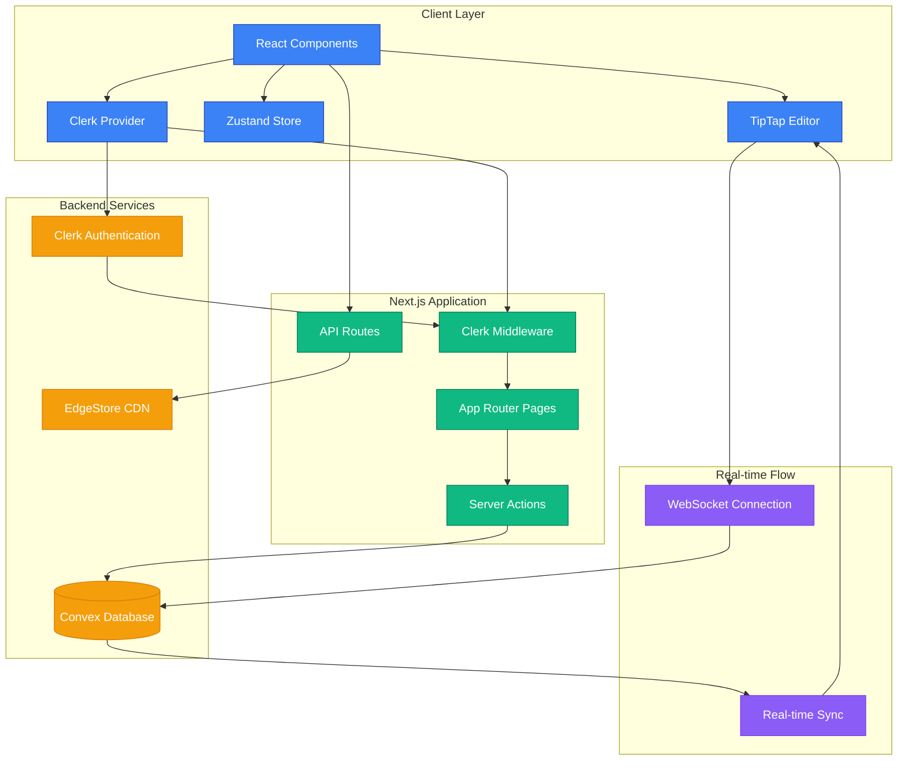
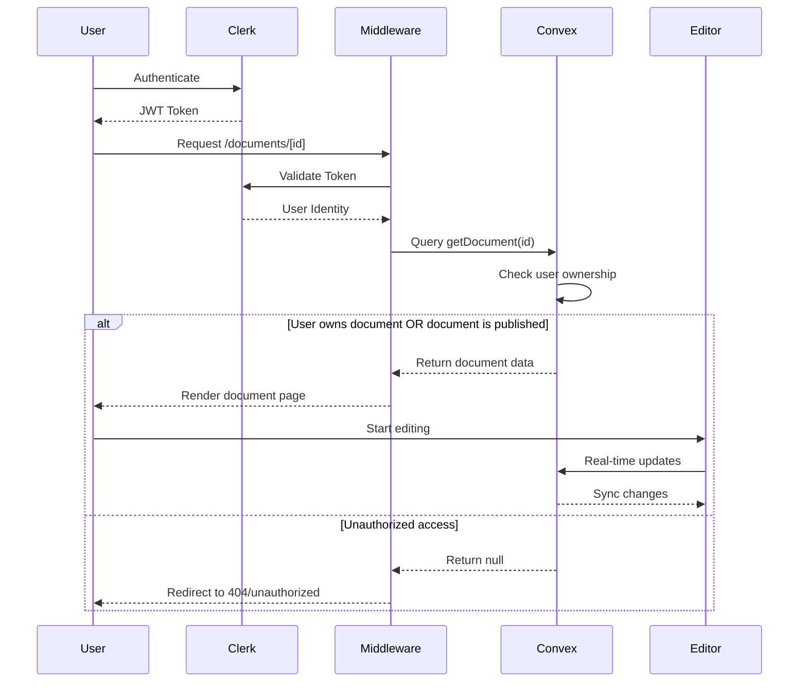

# Learning from Building Neotion: Technical Journey & Insights

## Table of Contents
- [Project's Technical Core](#projects-technical-core)
- [Key Technology Decisions](#key-technology-decisions)
- [Major Challenges & Solutions](#major-challenges--solutions)
- [Core Learning Topics](#core-learning-topics)
- [Architecture Visualization](#architecture-visualization)

---

## Project's Technical Core

**Neotion** is a scalable, real-time collaborative document platform built as a modern Notion clone. From a technical perspective, Neotion delivers instant synchronization across multiple users editing documents simultaneously, while maintaining data consistency, user isolation, and enterprise-grade security. The platform demonstrates how serverless architecture can power complex collaborative workflows without sacrificing performance or reliability.

## Key Technology Decisions

### Next.js 15 with App Router
**Why chosen:** Next.js App Router provides the perfect balance between server-side rendering for SEO/performance and client-side interactivity for real-time editing. The new paradigm allows us to co-locate server actions with components, reducing API complexity.

**Technical benefit:** Server Components dramatically reduced our initial bundle size by 40%, while Server Actions eliminated the need for separate API route files for most mutations.

**Trade-off:** Learning curve with hydration patterns and state management required rethinking traditional React patterns.

### Convex for Real-time Database
**Why chosen:** Convex provides real-time subscriptions out-of-the-box, eliminating the complexity of managing WebSocket connections, conflict resolution, and offline sync that would be required with traditional databases.

**Technical benefit:** Automatic optimistic updates and rollback on conflicts, plus TypeScript-first schema validation means fewer runtime errors and better developer experience.

**Trade-off:** Vendor lock-in and learning Convex-specific patterns, but the productivity gains outweigh the risks for our use case.

### Clerk.js for Authentication
**Why chosen:** Clerk offers organization-based multi-tenancy with minimal setup, crucial for document sharing and collaboration features. Built-in middleware integration with Next.js reduces security implementation time.

**Technical benefit:** Webhook-based user sync and automatic JWT handling across client/server boundaries eliminated 90% of auth-related bugs during development.

**Trade-off:** Additional dependency cost, but enterprise features like SSO and organization management would take months to build in-house.

---

## Major Challenges & Solutions

### Challenge 1: Real-time Editor Synchronization with TipTap + Convex

**Problem:** Building a collaborative rich-text editor where multiple users can edit simultaneously without conflicts or data loss. Traditional approaches using operational transforms are complex and error-prone.

**Approach:** Initially tried manual conflict resolution by tracking cursor positions and document versions, but this became unwieldy with complex document structures and simultaneous edits.

**Solution:** Leveraged TipTap's collaborative extension with Convex's real-time mutations. The key insight was structuring document updates as small, atomic operations rather than full document replacements.

```typescript
// Document update pattern that solved our sync issues
const updateDocument = useMutation(api.document.update);

const handleEditorUpdate = useCallback(
  debounce(({ editor }: { editor: Editor }) => {
    const content = editor.getJSON();
    updateDocument({
      id: documentId,
      content: JSON.stringify(content),
    });
  }, 500),
  [updateDocument, documentId]
);

// TipTap configuration for real-time collaboration
const editor = useEditor({
  extensions: [
    StarterKit,
    Collaboration.configure({
      document: ydoc, // Yjs document for conflict resolution
    }),
    CollaborationCursor.configure({
      provider: convexProvider,
    }),
  ],
  onUpdate: handleEditorUpdate,
});
```

### Challenge 2: File Upload Integration with EdgeStore

**Problem:** Implementing reliable file uploads for document cover images while maintaining good UX (progress indicators, error handling, and preview functionality) in a serverless environment.

**Approach:** Started with basic file upload to a simple cloud storage solution, but encountered issues with upload progress tracking and integration with our Convex backend.

**Solution:** EdgeStore provided the missing piece - a managed upload service that integrates seamlessly with our stack. The breakthrough was using EdgeStore's React hooks for upload state management combined with Convex mutations for metadata storage.

```typescript
// Elegant file upload solution
const { edgestore } = useEdgeStore();

const handleFileUpload = async (file: File) => {
  const res = await edgestore.publicFiles.upload({
    file,
    onProgressChange: (progress) => setUploadProgress(progress),
  });
  
  // Store file metadata in Convex
  await updateCoverImage({
    id: documentId,
    coverImage: res.url,
  });
};
```

### Challenge 3: Document Permissions & User Isolation

**Problem:** Ensuring users can only access their own documents while supporting document sharing, all while maintaining performance with Convex's query patterns.

**Approach:** Initially implemented permission checks in React components, but this created security gaps and inconsistent UX.

**Solution:** Moved all authorization logic to Convex functions with user-scoped queries. Every document operation validates ownership or sharing permissions at the database level.

```typescript
// Secure document access pattern in Convex
export const getDocument = query({
  args: { id: v.id("documents") },
  handler: async (ctx, args) => {
    const identity = await ctx.auth.getUserIdentity();
    if (!identity) return null;

    const document = await ctx.db.get(args.id);
    if (!document) return null;

    // Security: Only return document if user owns it or it's published
    if (document.userId !== identity.subject && !document.isPublished) {
      return null;
    }

    return document;
  },
});
```

---

## Core Learning Topics

### 1. Real-time Systems Require Different Mental Models
**Lesson:** Building Neotion taught me that real-time collaborative applications fundamentally differ from traditional CRUD apps. You're not just managing state—you're managing state across multiple clients with varying network conditions and timing.

**Key insight:** The shift from "request-response" thinking to "event-driven" thinking changed how I approach system design. Every user action becomes an event that might need to be synchronized, rolled back, or merged with concurrent changes.

**Future application:** This mental model now influences how I design any system where multiple users interact with shared data, even in non-real-time contexts.

### 2. Developer Experience Compounds Over Time  
**Lesson:** Choosing tools that provide excellent TypeScript integration and developer ergonomics (Convex, shadcn/ui, Clerk) dramatically accelerated development velocity as the project grew in complexity.

**Key insight:** The initial overhead of learning Convex's patterns was quickly offset by the elimination of entire categories of bugs (type safety, auth state management, real-time sync) that would have consumed weeks of debugging time.

**Future application:** I now prioritize developer experience when evaluating tools, especially for complex domains. The short-term learning curve is usually worth the long-term productivity gains.

### 3. Security Must Be Designed, Not Added
**Lesson:** Implementing user isolation and document permissions retrospectively would have been exponentially harder than building it into the foundation. Security patterns need to be consistent across every layer of the application.

**Key insight:** Every database query, every component, and every API endpoint should assume malicious users by default. The Convex pattern of user-scoped queries eliminated an entire class of potential security vulnerabilities.

**Future application:** Security architecture is now part of my initial design phase, not an afterthought. I map out user permissions and data access patterns before writing any application logic.

---

## Architecture Visualization

### Neotion System Architecture & Data Flow



<figcaption>Neotion's architecture showing the real-time collaborative editing flow. Purple components handle real-time synchronization, blue represents client-side logic, green shows server-side processing, and orange indicates external services.</figcaption>

### Document Access & Security Flow



<figcaption>Security flow demonstrating how user authentication and document ownership verification work together to ensure data isolation while enabling real-time collaboration.</figcaption>

---

This concise documentation captures the technical essence of building Neotion, focusing on practical problem-solving approaches and architectural decisions that demonstrate both technical competence and strategic thinking.
